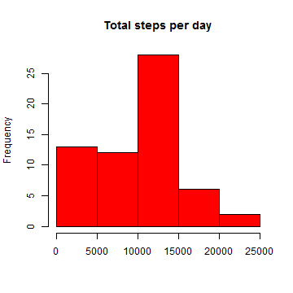
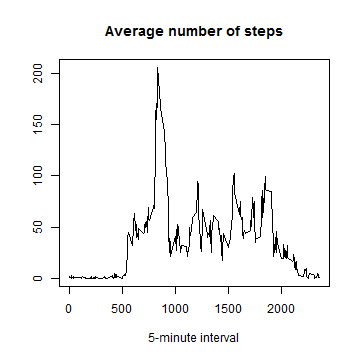
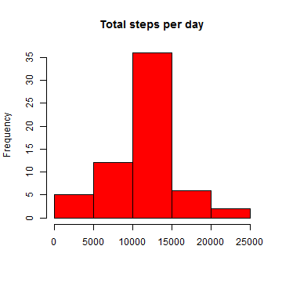
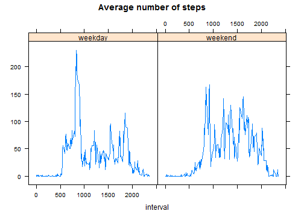

# Reproducible Research: Peer Assessment 1

Packages and settings:


```r
library(plyr)
library(lattice)
Sys.setlocale(category="LC_TIME", locale="English")
```

```
## [1] "English_United States.1252"
```


## Loading and preprocessing the data


```r
unzip("activity.zip")
activity<-read.csv("activity.csv",sep=",")
activity$date<-strptime(activity$date, "%Y-%m-%d")
```


## What is the mean total number of steps taken per day?

Histogram of the total number of steps taken each day:


```r
totalstep_day<-ddply(activity,.(date),summarise,totalsteps=sum(steps,na.rm = TRUE))
with(totalstep_day,hist(totalsteps,col=2,main="Total steps per day",xlab=""))
```

 

Mean and median of the total number of steps taken per day:


```r
mean(totalstep_day$totalsteps)
```

```
## [1] 9354
```

```r
median(totalstep_day$totalsteps)
```

```
## [1] 10395
```


## What is the average daily activity pattern?

Time series plot of the 5-minute interval and the average number of steps taken, averaged across all days:


```r
meanstep_interval<-ddply(activity,.(interval),summarise,meansteps=mean(steps,na.rm = TRUE))
with(meanstep_interval, plot(interval, meansteps,type="l",xlab="5-minute interval",ylab="",main="Average number of steps"))
```

 

5-minute interval which contains the maximum number of steps (on average across all the days):


```r
aux<-which(meanstep_interval$meansteps==max(meanstep_interval$meansteps))
meanstep_interval$interval[aux]
```

```
## [1] 835
```


## Imputing missing values

Number of rows with NAs:


```r
sum(is.na(activity$steps))
```

```
## [1] 2304
```

Imputing missing values replacing NAs by the mean for the corresponding 5-minute interval:


```r
n<-length(activity$steps)
activity_nonas<-activity
for (i in 1:n)
  {
	if (is.na(activity_nonas$steps[i])==TRUE) 
		activity_nonas$steps[i]<-meanstep_interval$meansteps[which(meanstep_interval$interval==activity_nonas$interval[i])]
	}
```

Histogram of total number of steps taken each day with imputed data:


```r
totalstep_daynonas<-ddply(activity_nonas,.(date),summarise,totalsteps=sum(steps))
with(totalstep_daynonas,hist(totalsteps,col=2,main="Total steps per day",xlab=""))
```

 

Media and median of total number of steps taken per day with imputed data:


```r
mean(totalstep_daynonas$totalsteps)
```

```
## [1] 10766
```

```r
median(totalstep_daynonas$totalsteps)
```

```
## [1] 10766
```

Histogram is more symmetrical with imputed data. Therefore, values of media and median are similar with imputed data and different with raw data (with NAs). 


## Are there differences in activity patterns between weekdays and weekends?


```r
activity_nonas$day<-rep("weekday",n)
activity_nonas$day[weekdays(activity_nonas$date) %in% c("Saturday","Sunday")]<-"weekend"
activity_nonas$day<-factor(activity_nonas$day)
meanstep_intervalnonas<-ddply(activity_nonas,.(interval,day),summarise,meansteps=mean(steps))
xyplot(meansteps ~ interval | day, meanstep_intervalnonas, ylab="", type="l", main="Average number of steps")
```

 


